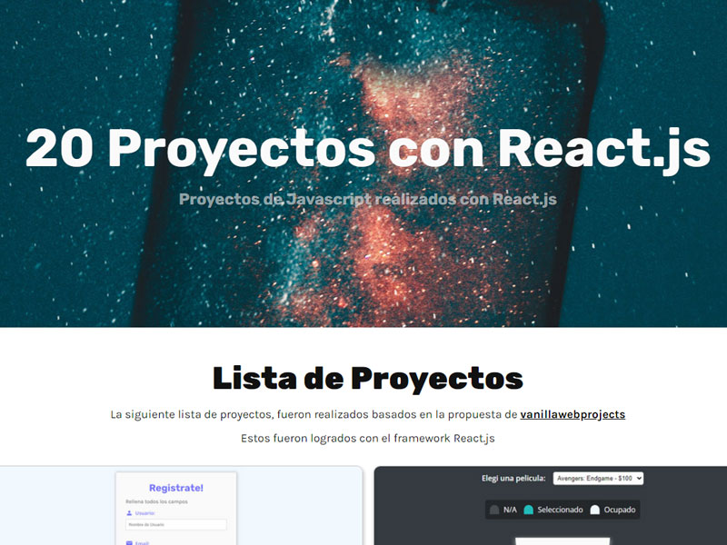

  

# 20 proyectos con React.js

  



  
  

**20 Poyectos con react.js**

***HTML - CSS - JAVASCRIPT - REACT.js***

  

[Ver demo 👀](https://gabrielteresczuk.github.io/20projectsreact/)

  

## Descripción 📑

  

Se realiza este proyecto a modo de practica, logrando completar todos los desafíos propuestos por [# 20+ Web Projects With Vanilla JavaScript](https://github.com/bradtraversy/vanillawebprojects)

  

Los objetivos a lograr son los siguientes:

  

1. Realizar con React, una interfaz para administracion y visualizacion de los mini proyectos

2. Adjuntar todos los proyectos .

3. Tomar solo la ayuda visual, sin depender de los codigos.

4. Intentar mejorar la versión original.

5. Dar alguna otra pequeña opcion extra o cambio en el diseño.

6. Recopilar todo lo aprendido en esta guía.


### Que aprendí 💡

  

En esta sección se detallaran, algunas técnicas que se aprendieron a lo largo de la realización del proyecto.

  
1 - useRef();

```jsx

const  usuario = useRef();
<input  type='text'  name='usuario'  id='usuario'  
ref={usuario}/>
usuario.current.className = 'rojo';

```


  
  

## Autor 😎

  

- Linkedin - [in/gabriel-teresczuk](https://www.linkedin.com/in/gabriel-teresczuk/)